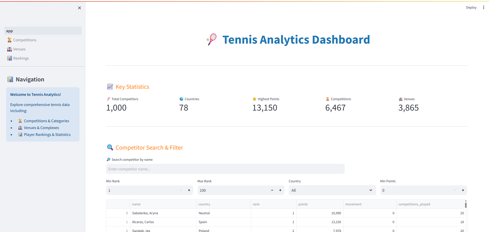
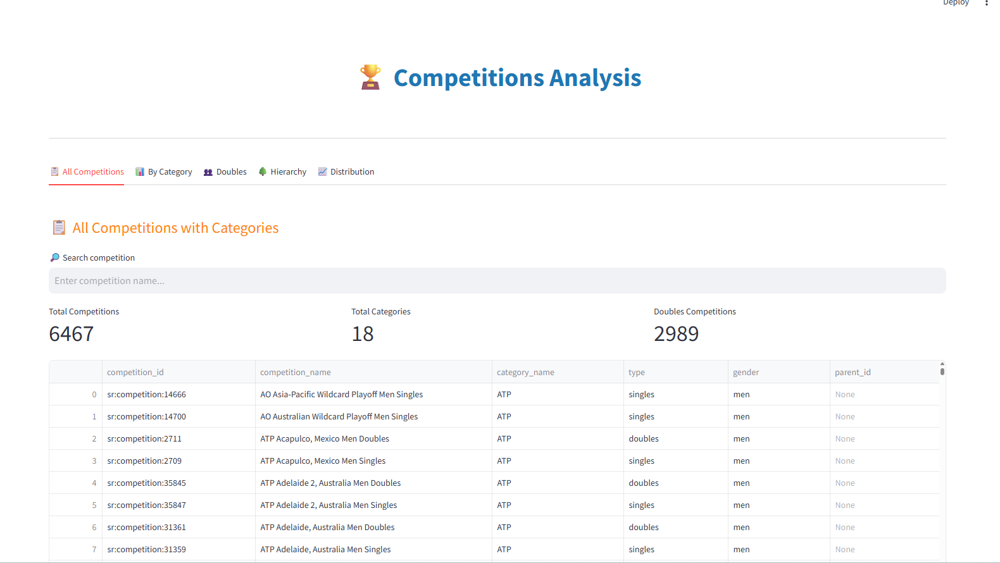
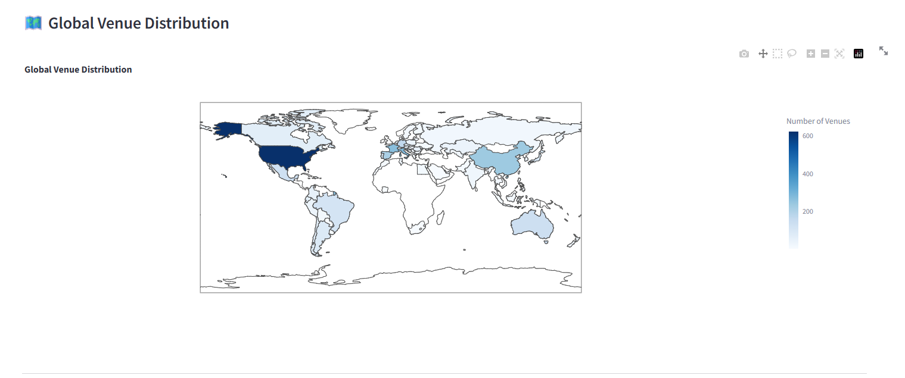
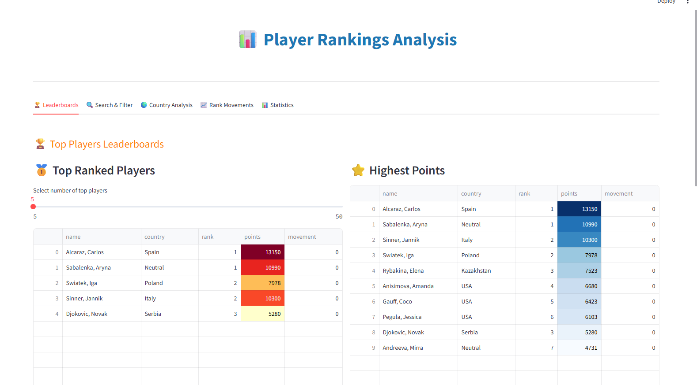

# 🎾 Tennis Analytics: Unlocking Tennis Data with SportRadar API

A comprehensive data analytics solution for managing, visualizing, and analyzing tennis competition data from the SportRadar API. This project features a complete ETL pipeline with data extraction, MSSQL database storage, and an interactive Streamlit web application for real-time insights.


---

## 📋 Table of Contents

- [Overview](#overview)
- [Features](#features)
- [Tech Stack](#tech-stack)
- [Project Structure](#project-structure)
- [Prerequisites](#prerequisites)
- [Installation](#installation)
- [Configuration](#configuration)
- [Usage](#usage)
- [Database Schema](#database-schema)
- [SQL Queries](#sql-queries)
- [Streamlit Application](#streamlit-application)
- [Screenshots](#screenshots)
- [API Documentation](#api-documentation)
- [Troubleshooting](#troubleshooting)
- [Future Enhancements](#future-enhancements)
- [Contributing](#contributing)
- [License](#license)
- [Contact](#contact)

---

## 🎯 Overview

The **Tennis Analytics Dashboard** is a full-stack data analytics project that:

1. **Extracts** tennis competition data from the SportRadar API
2. **Transforms** JSON data into a structured relational format
3. **Loads** data into a Microsoft SQL Server database
4. **Visualizes** insights through an interactive Streamlit web application

This project is designed for sports enthusiasts, analysts, and organizations to understand competition structures, player rankings, venue distributions, and performance trends.

---

## ✨ Features

### Data Collection & Management
- 🔄 Automated data extraction from SportRadar API (Competitions, Venues, Rankings)
- 🗄️ Structured storage in MSSQL Server with proper relationships
- 🔐 Error handling for API rate limits and database constraints
- 📊 Support for hierarchical data (parent-child competitions)

### Interactive Dashboard
- 🏠 **Homepage**: Key statistics, competitor search & filter, leaderboards
- 🏆 **Competitions Analysis**: Category-wise breakdown, doubles competitions, hierarchy visualization
- 🏟️ **Venues & Complexes**: Global distribution, timezone analysis, country-wise statistics
- 📊 **Player Rankings**: Top players, rank movements, country analysis, detailed statistics

### Advanced Analytics
- 🔍 Real-time search and filtering
- 📈 Interactive charts (Bar, Pie, Scatter, Histogram)
- 🌍 Geographical distribution analysis
- 📥 CSV export functionality
- 🎯 Drill-down capabilities for detailed insights

---

## 🛠️ Tech Stack

### Programming Languages
- **Python 3.11** - Core development language

### Database
- **Microsoft SQL Server 2019** - Relational database
- **ODBC Driver 17/18** - Database connectivity

### Libraries & Frameworks
```
streamlit==1.28.0          # Web application framework
pandas==2.1.0              # Data manipulation
sqlalchemy==2.0.20         # Database ORM
pyodbc==5.0.1              # SQL Server connectivity
requests==2.31.0           # API calls
plotly==5.17.0             # Interactive visualizations
python-dotenv==1.0.0       # Environment management
matplotlib==3.8.0          # Additional plotting
```

### API
- **SportRadar Tennis API** - Data source (Trial/Free tier)

---

## 📁 Project Structure

```
tennis-analytics/
│
├── .env                              # Environment variables (not in git)
├── .gitignore                        # Git ignore file
├── README.md                         # Project documentation
├── requirements.txt                  # Python dependencies
│
├── data_extraction/                  # API data extraction modules
│   ├── __init__.py
│   ├── api_client.py                # SportRadar API wrapper
│   ├── extract_competitions.py      # Competition data extractor
│   ├── extract_complexes.py         # Venues/complexes extractor
│   └── extract_rankings.py          # Rankings data extractor
│
├── database/                         # Database management
│   ├── __init__.py
│   ├── db_connection.py             # MSSQL connection handler
│   ├── schema_creation.sql          # Database schema DDL
│   ├── queries.sql                  # All SQL queries
│   └── data_loader.py               # Data loading script
│
├── streamlit_app/                    # Streamlit web application
│   ├── app.py                       # Main dashboard (Homepage)
│   ├── pages/
│   │   ├── 1_🏆_Competitions.py    # Competitions analysis page
│   │   ├── 2_🏟️_Venues.py         # Venues analysis page
│   │   └── 3_📊_Rankings.py        # Rankings analysis page
│   └── utils/
│       ├── __init__.py
│       ├── db_helper.py             # Database query functions
│       └── visualizations.py        # Chart/visualization functions
│
├── load_data.py                      # Main data loading script
├── load_data_direct.py               # Alternative loader (pyodbc)
├── test_api_connection.py            # API connection test
├── test_db_connection.py             # Database connection test
└── check_odbc_drivers.py             # ODBC driver checker
```

---

## 📦 Prerequisites

### Software Requirements
- **Python 3.11+** - [Download](https://www.python.org/downloads/)
- **Microsoft SQL Server** (Express/Developer/Enterprise)
  - [SQL Server 2019 Express](https://www.microsoft.com/en-us/sql-server/sql-server-downloads)
  - [SQL Server Management Studio (SSMS)](https://aka.ms/ssmsfullsetup)
- **ODBC Driver 17 or 18 for SQL Server**
  - [Download](https://learn.microsoft.com/en-us/sql/connect/odbc/download-odbc-driver-for-sql-server)

### API Requirements
- **SportRadar API Key** (Free Trial)
  - Sign up at [SportRadar Developer Portal](https://console.sportradar.com/signup)

### System Requirements
- **OS**: Windows 10/11, macOS, Linux
- **RAM**: 4GB minimum (8GB recommended)
- **Storage**: 500MB free space
- **Internet**: Required for API calls

---

## 🚀 Installation

### Step 1: Clone the Repository

```bash
git clone https://github.com/yourusername/tennis-analytics.git
cd tennis-analytics
```

### Step 2: Create Virtual Environment

```bash
# Windows
python -m venv venv
venv\Scripts\activate

# macOS/Linux
python3 -m venv venv
source venv/bin/activate
```

### Step 3: Install Dependencies

```bash
pip install -r requirements.txt
```

### Step 4: Install SQL Server & ODBC Driver

1. Install SQL Server (if not already installed)
2. Install SQL Server Management Studio (SSMS)
3. Install ODBC Driver 17 or 18

**Verify ODBC Driver Installation:**
```bash
python check_odbc_drivers.py
```

---

## ⚙️ Configuration

### Step 1: Create Database

Open **SQL Server Management Studio (SSMS)** and run:

```sql
-- Create database
CREATE DATABASE TennisAnalytics;
GO

-- Create tables (run the entire schema_creation.sql file)
USE TennisAnalytics;
GO
-- (Copy content from database/schema_creation.sql)
```

### Step 2: Setup Environment Variables

Create a `.env` file in the project root:

```env
# SportRadar API
SPORTRADAR_API_KEY=your_api_key_here

# MSSQL Database Configuration
DB_SERVER=YOUR_SERVER_NAME\SQLEXPRESS
DB_NAME=TennisAnalytics
DB_USER=
DB_PASSWORD=
DB_DRIVER=ODBC Driver 17 for SQL Server
```

**Important:** Replace `YOUR_SERVER_NAME` with your actual SQL Server instance name.

**Finding Your Server Name:**
- Open SSMS
- Look at the "Server name" in the connection dialog
- Example: `DESKTOP-ABC123\SQLEXPRESS` or `localhost\SQLEXPRESS`

### Step 3: Get SportRadar API Key

1. Go to [SportRadar Console](https://console.sportradar.com/signup)
2. Create an account and verify email
3. Create a new application
4. Select **Tennis API** and **Trial** plan
5. Copy your API key
6. Paste it in the `.env` file

---

## 💻 Usage

### 1. Test Connections

**Test Database Connection:**
```bash
python test_db_connection.py
```

Expected output:
```
✓ Database connection successful!
SQL Server Version: Microsoft SQL Server 2019...
```

**Test API Connection:**
```bash
python test_api_connection.py
```

Expected output:
```
Testing Competitions API...
✓ Competitions API working! Found 6467 competitions

Testing Complexes API...
✓ Complexes API working! Found 756 complexes

Testing Rankings API...
✓ Rankings API working! Found 100 rankings
```

### 2. Load Data into Database

**Important:** This will make API calls and insert data. Run only once or when updating data.

```bash
python load_data_direct.py
```

Expected output:
```
============================================================
=== Loading Competitions Data ===
============================================================
Fetching competitions data...
Extracted 18 categories
Extracted 6467 competitions
✓ Inserted 18 rows into Categories
✓ Inserted 6467 rows into Competitions

============================================================
=== Loading Complexes Data ===
============================================================
Fetching complexes data...
Extracted 756 complexes
Extracted 1234 venues
✓ Inserted 756 rows into Complexes
✓ Inserted 1234 rows into Venues

============================================================
=== Loading Rankings Data ===
============================================================
Fetching rankings data...
Extracted 100 competitors
Extracted 100 rankings
✓ Inserted 100 rows into Competitors
✓ Inserted 100 rows into Competitor_Rankings

✓✓✓ All data loaded successfully! ✓✓✓

=== Database Summary ===
Categories: 18
Competitions: 6467
Complexes: 756
Venues: 1234
Competitors: 100
Rankings: 100
```

### 3. Launch Streamlit Application

```bash
streamlit run streamlit_app/app.py
```

The application will open in your browser at:
```
http://localhost:8501
```

---

## 🗄️ Database Schema

### Entity Relationship Diagram

```
Categories (1) ──────< (N) Competitions
                            │
                            └──< (N) Competitions (self-reference for parent-child)

Complexes (1) ───────< (N) Venues

Competitors (1) ─────< (N) Competitor_Rankings
```

### Tables

#### 1. Categories
```sql
category_id VARCHAR(50) PRIMARY KEY
category_name VARCHAR(100) NOT NULL
```

#### 2. Competitions
```sql
competition_id VARCHAR(50) PRIMARY KEY
competition_name VARCHAR(100) NOT NULL
parent_id VARCHAR(50) NULL (FK → Competitions)
type VARCHAR(20) NOT NULL
gender VARCHAR(10)
category_id VARCHAR(50) NOT NULL (FK → Categories)
```

#### 3. Complexes
```sql
complex_id VARCHAR(50) PRIMARY KEY
complex_name VARCHAR(100) NOT NULL
```

#### 4. Venues
```sql
venue_id VARCHAR(50) PRIMARY KEY
venue_name VARCHAR(100) NOT NULL
city_name VARCHAR(100) NOT NULL
country_name VARCHAR(100) NOT NULL
country_code CHAR(3)
timezone VARCHAR(100) NOT NULL
complex_id VARCHAR(50) NOT NULL (FK → Complexes)
```

#### 5. Competitors
```sql
competitor_id VARCHAR(50) PRIMARY KEY
name VARCHAR(100) NOT NULL
country VARCHAR(100) NOT NULL
country_code CHAR(3)
abbreviation VARCHAR(10) NOT NULL
```

#### 6. Competitor_Rankings
```sql
rank_id INT IDENTITY(1,1) PRIMARY KEY
rank INT NOT NULL
movement INT NOT NULL
points INT NOT NULL
competitions_played INT NOT NULL
competitor_id VARCHAR(50) NOT NULL (FK → Competitors)
```

---

## 📊 SQL Queries

The project includes comprehensive SQL queries for analysis. All queries are documented in `database/queries.sql`.

### Competitions Analysis (7 Queries)
- List all competitions with category names
- Count competitions per category
- Find doubles competitions
- Get competitions by specific category
- Identify parent-child relationships
- Analyze competition type distribution
- List top-level competitions

### Venue Analysis (7 Queries)
- List venues with complex names
- Count venues per complex
- Get venues by country
- List all venues with timezones
- Find complexes with multiple venues
- Group venues by country
- Get venues for specific complex

### Ranking Analysis (6 Queries)
- Get all competitors with rank and points
- Find top 5 ranked competitors
- List stable rank competitors
- Get total points by country
- Count competitors per country
- Find highest points competitors

**Total: 20+ SQL Queries**

---

## 🎨 Streamlit Application

### Homepage Dashboard
- **Key Metrics**: Total competitors, countries, highest points, competitions, venues
- **Competitor Search**: Real-time search by name
- **Advanced Filters**: Rank range, country, points threshold
- **Competitor Details**: Detailed view with rank, movement, points, competitions
- **Country Analysis**: Statistics and visualizations
- **Leaderboards**: Top ranked players and highest points

### Page 1: 🏆 Competitions Analysis
**5 Tabs:**
1. **All Competitions** - Searchable table with 6467+ competitions
2. **By Category** - Distribution charts and category breakdown
3. **Doubles** - Gender-wise doubles competition analysis
4. **Hierarchy** - Parent-child tournament relationships
5. **Distribution** - Type distribution by category

### Page 2: 🏟️ Venues Analysis
**5 Tabs:**
1. **All Venues** - Global venue database with search
2. **By Complex** - Multi-venue complexes analysis
3. **By Country** - Geographical distribution with world map
4. **Timezones** - Timezone-based venue grouping
5. **Statistics** - Comprehensive venue statistics

### Page 3: 📊 Rankings Analysis
**5 Tabs:**
1. **Leaderboards** - Top ranked and highest points players
2. **Search & Filter** - Advanced filtering with details viewer
3. **Country Analysis** - Country-wise player statistics
4. **Rank Movements** - Climbers, fallers, and movement trends
5. **Statistics** - Distribution analysis and correlations

---

## 📸 Screenshots

### Homepage Dashboard
```

```

### Competitions Analysis
```

```

### Venues Map Visualization
```

```

### Rankings Leaderboard
```

```

---

## 📚 API Documentation

### SportRadar Tennis API v3

**Base URL:** `https://api.sportradar.com/tennis/trial/v3/en`

**Endpoints Used:**

1. **Competitions**
   - Endpoint: `/competitions.json`
   - Returns: All tennis competitions with categories

2. **Complexes**
   - Endpoint: `/complexes.json`
   - Returns: Sports complexes and associated venues

3. **Rankings**
   - Endpoint: `/rankings.json`
   - Returns: Current player rankings (singles)

**Rate Limits:**
- Free Trial: 1 request per second, 1000 requests per month
- Automatic retry with exponential backoff implemented

**Authentication:**
- API Key passed as query parameter: `?api_key=YOUR_KEY`

---

## 🔧 Troubleshooting

### Common Issues

#### 1. Database Connection Error
**Error:** `Data source name not found`

**Solution:**
- Verify SQL Server is running
- Check server name in `.env` matches SSMS
- Install ODBC Driver 17 or 18
- Use Windows Authentication (leave user/password blank)

#### 2. API Rate Limit
**Error:** `429 Too Many Requests`

**Solution:**
- Script automatically retries after 60 seconds
- Don't run data loader multiple times quickly
- Check monthly quota (1000 requests for trial)

#### 3. Import Errors
**Error:** `ModuleNotFoundError: No module named 'X'`

**Solution:**
```bash
pip install -r requirements.txt
```

#### 4. Matplotlib Error in Streamlit
**Error:** `background_gradient requires matplotlib`

**Solution:**
```bash
pip install matplotlib
```

#### 5. Foreign Key Constraint Error
**Error:** `INSERT statement conflicted with FOREIGN KEY constraint`

**Solution:**
- Clear database tables before reloading
- Use `load_data_direct.py` which handles hierarchical inserts

---

## 🚀 Future Enhancements

- [ ] **Real-time Data Updates**: Schedule automatic data refresh
- [ ] **Player Profile Pages**: Detailed individual player analytics
- [ ] **Match Results Integration**: Add live match data
- [ ] **Predictive Analytics**: ML models for ranking predictions
- [ ] **Mobile Responsive Design**: Optimize for mobile devices
- [ ] **User Authentication**: Multi-user access with saved preferences
- [ ] **Export to PDF**: Generate analytical reports
- [ ] **API Integration**: Additional sports data sources
- [ ] **Advanced Visualizations**: 3D charts, heatmaps
- [ ] **Historical Data Tracking**: Track ranking changes over time

---

## 🤝 Contributing

Contributions are welcome! Please follow these steps:

1. Fork the repository
2. Create a feature branch (`git checkout -b feature/AmazingFeature`)
3. Commit your changes (`git commit -m 'Add some AmazingFeature'`)
4. Push to the branch (`git push origin feature/AmazingFeature`)
5. Open a Pull Request

### Coding Standards
- Follow PEP 8 for Python code
- Add docstrings to all functions
- Include comments for complex logic
- Test before submitting PR

---

## 📄 License

This project is licensed under the MIT License - see the [LICENSE](LICENSE) file for details.

---

---

## 🙏 Acknowledgments

- **SportRadar** for providing the Tennis API
- **Streamlit** for the amazing web framework
- **Plotly** for interactive visualizations
- **Microsoft** for SQL Server

---

